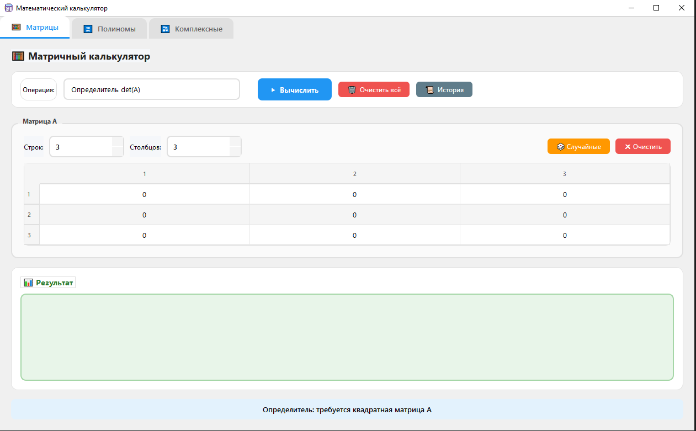
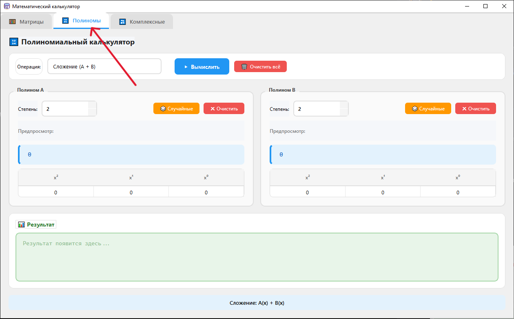
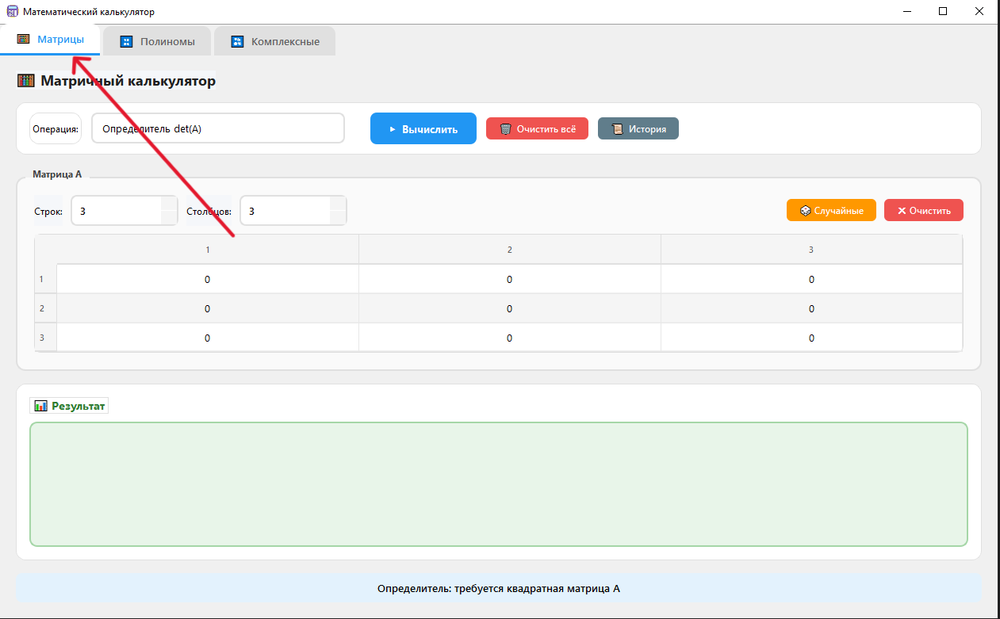
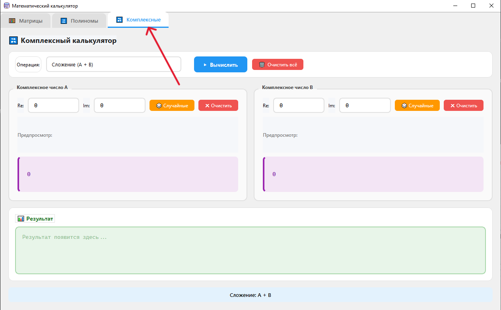

<h1 align="center"> MathCalculator</h1>

<div align="center">


<p style="font-size: 1.3em; line-height: 1.6; margin: 24px 0 16px 0;">
  <b>MathCalculator</b> — кроссплатформенное десктопное приложение для выполнения математических вычислений.<br>
  Поддерживает работу с комплексными числами, матрицами и полиномами через удобный графический интерфейс на Qt6.
</p>



*Десктопное приложение для выполнения вычислений с матрицами, полиномами и комплексными числами*

</div>

---

<h1 align="center"> 📁 Структура проекта</h1>

```
MathCalculator/
├── app/                      # Точка входа (main.cpp)
│   ├── main.cpp 
├── core/                     # Бизнес-логика
│   ├── Complex.h             # Комплексные числа
│   ├── Matrix.h              # Матрицы
│   └── Polynom.h             # Полиномы
├── gui/                      # Интерфейс Qt
│   ├── Mainwindow.cpp/h      # Главное окно
│   ├── Complex/              # Вкладка комплексных чисел
│   ├── Matrix/               # Вкладка матриц
│   │   ├── MatrixTab.cpp/h
│   │   └── OperationHistory.cpp/h
│   └── Polynom/              # Вкладка полиномов
├── tests/                    # Модульные тесты
│   ├── test_utils.h          # Утилиты для тестов
│   ├── main_test_.cpp              # Точка входа тестов
│   ├── complex_tests.cpp
│   ├── matrix_tests.cpp
│   └── polynom_tests.cpp
├── resources/                # Ресурсы (иконки, .qrc)
├── CMakeLists.txt            # Основной файл сборки
└── README.md                 # Документация
```

<div style="background: border-left: 4px solid #0366d6; padding: 12px 16px; margin: 16px 0; border-radius: 0 6px 6px 0;">
  <strong>📦 Минимальная структура</strong><br>
  Показаны только ключевые файлы для запуска проекта. Остальные файлы (настройка CI, линтеры, доп. утилиты) опущены для наглядности.
</div>

---

<h1 align="center"> 🚀 Инструкция по запуску</h1>

### ⚙️ Системные требования

<div align="center">

| Компонент | Версия | Примечание |
|-----------|--------|------------|
| **C++ компилятор** | C++17 и выше | MSVC 2022 / GCC 11+ / Clang 14+ |
| **Qt Framework** | 6.5+ | Модули: `Core`, `Widgets` |
| **CMake** | 3.19+ | Система сборки |
| **ОС** | Win / Linux / macOS | Кроссплатформенно |

</div>

> 💡 **Совет:** Убедись, что путь к Qt добавлен в переменную окружения `PATH` (Windows) или `CMAKE_PREFIX_PATH` (Linux/macOS), если CMake не находит библиотеки автоматически.

### ❓ Если CMake не находит Qt

Решение настраивается через **CMake Tools** (расширение для VS Code / Qt Creator / CLion):

1. Откройте конфигурацию CMake проекта.
2. В настройках сборки найдите или добавьте переменную `CMAKE_PREFIX_PATH`.
3. Укажите прямой путь к папке нужной версии Qt, например:
   ```
   CMAKE_PREFIX_PATH="C:/Qt/6.5.1/msvc2022_64"
	```
---

### 🔹 Быстрый старт (универсальный)

```bash
# 1. Клонировать репозиторий
git clone https://github.com/Artre0n/MathCalculator.git
cd MathCalculator

# 2. Создать и настроить папку сборки
cmake -B build -S .

# 3. Скомпилировать проект
cmake --build build

# 4. Запустить приложение
# Windows:
build\Debug\MathCalculator.exe
# Linux/macOS:
./build/MathCalculator
```

---

### 🔹 Подробная инструкция по платформам

#### 1. Windows (MSVC + Qt)
1. Открой **Qt Command Prompt** (или x64 Native Tools Command Prompt for VS).
2. Выполни команды:
   ```cmd
   cmake -B build -G "Ninja" -DCMAKE_BUILD_TYPE=Release
   cmake --build build --config Release
   ```
3. Запусти: `build\Debug\MathCalculator.exe`

> ⚠️ **Важно:** Если при запуске появляются ошибки о недостающих `.dll`, убедись, что папка `bin` от Qt добавлена в `PATH`, или скопируй нужные DLL рядом с `.exe`.

####  2. Linux (GCC/Clang)
1. Установи зависимости (пример для Ubuntu/Debian):
   ```bash
   sudo apt install build-essential cmake qt6-base-dev libqt6widgets6
   ```
2. Собери проект:
   ```bash
   cmake -B build -DCMAKE_BUILD_TYPE=Release
   cmake --build build -j$(nproc)
   ```
3. Запусти:
   ```bash
   ./build/MathCalculator
   ```

####  3. macOS (Clang + Homebrew)
1. Установи Qt через Homebrew:
   ```bash
   brew install qt cmake
   ```
2. Настрой окружение (если нужно):
   ```bash
   export PATH="$(brew --prefix qt)/bin:$PATH"
   export CMAKE_PREFIX_PATH="$(brew --prefix qt)"
   ```
3. Собери и запусти:
   ```bash
   cmake -B build -DCMAKE_BUILD_TYPE=Release
   cmake --build build
   ./build/MathCalculator.app/Contents/MacOS/MathCalculator
   ```
   ### 🔹 Параметры сборки CMake (опционально)

<div align="center">

| Параметр | Значение по умолчанию | Описание |
|----------|----------------------|----------|
| `CMAKE_BUILD_TYPE` | `Debug` | Режим: `Debug` / `Release` / `RelWithDebInfo` |
| `CMAKE_INSTALL_PREFIX` | системный | Куда ставить при `cmake --install` |
| `QT_VERSION` | `6.5` | Минимальная версия Qt для поиска |

</div>

---
### 🔄 Переключение вкладок

<table align="center">
  <tr>
    <td align="center" style="padding: 10px;">
      
      <p style="margin-top: 10px; font-size: 14px;">
        <b>Нужно нажать сюда</b><br>
        <span style="color: #595;">Вкладка «Полиномы»</span>
      </p>
    </td>
    <td align="center" style="padding: 10px;">
      
      <p style="margin-top: 10px; font-size: 14px;">
        <b>Нужно нажать сюда</b><br>
        <span style="color: #595;">Вкладка «Матрицы»</span>
      </p>
    </td>
    <td align="center" style="padding: 10px;">
      
      <p style="margin-top: 10px; font-size: 14px;">
        <b>Нужно нажать сюда</b><br>
        <span style="color: #595;">Вкладка «Комплексные числа»</span>
      </p>
    </td>
  </tr>
</table>
